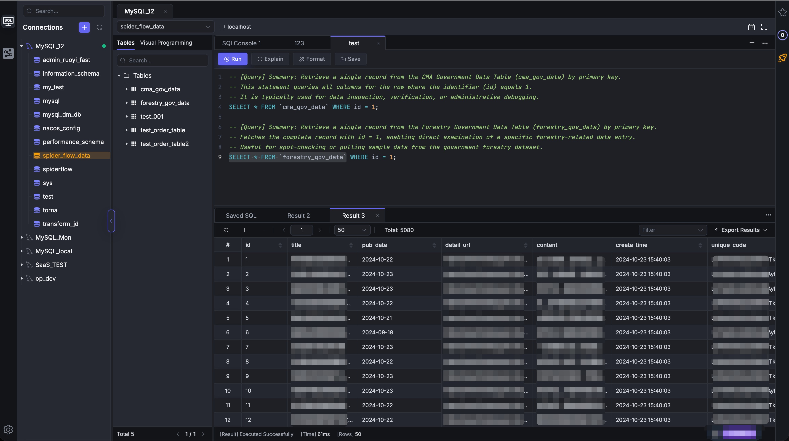
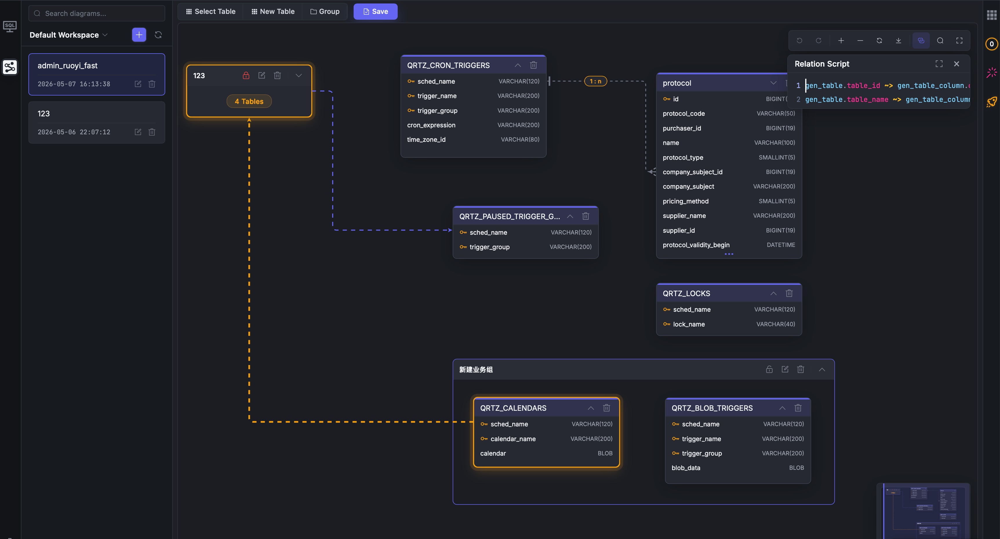

  

  # SQLayer_Mind
  
  **The Ultimate AI-Native SQL Workspace & Immersive ER Diagram Designer.**

  
  
  
  

  

    <a href="你的官网链接">Official Website</a> •
    <a href="你的文档链接">Documentation</a> •
    <a href="#key-capabilities">Key Capabilities</a>
  

---

## 🖥️ Immersive Workspace

Built with **Tauri & Rust**, SQLayer_Mind delivers a blazing-fast, native experience for both database development and architectural design.

### ⚡ Professional SQL Client
Streamlined data extraction and processing with modern "Geek Blue" aesthetics.

  

### 🎨 Advanced ER Modeling
Design logical links and physical foreign keys on a high-performance canvas with Relation Scripting and Group management.

  

## 🤖 AI-Driven Blueprint Generation
Turn your business requirements into database architecture in seconds.

  <video src="https://github.com/user-attachments/assets/23785860-c3fe-4172-9e7c-a3660c3da0a1" width="600" controls autoplay loop muted playsinline style="border-radius: 8px; box-shadow: 0 4px 20px rgba(0,0,0,0.3);">
  </video>

---

## 📖 What is SQLayer-Mind?

**SQLayer-Mind is a proprietary software.** This repository serves as the official hub for releases, community discussions, and issue tracking.

It bridges the gap between raw SQL development and architectural design, allowing developers to go from natural language to complex database blueprints in seconds.

### 🚀 Key Capabilities
* **Text-to-ER**: Generate complex database schemas via conversational AI.
* **Hybrid Modeling**: Support for both **Logical Links** and **Physical Foreign Keys**.
* **BYOK (Bring Your Own Key)**: Total privacy and zero markup on AI costs.
* **Native Performance**: Blazing fast startup and low memory footprint (<= 14MB).

---

🚀 **Coming Soon!**

We are currently preparing the initial public release and comprehensive documentation.

*Estimated Launch: May 2026*
